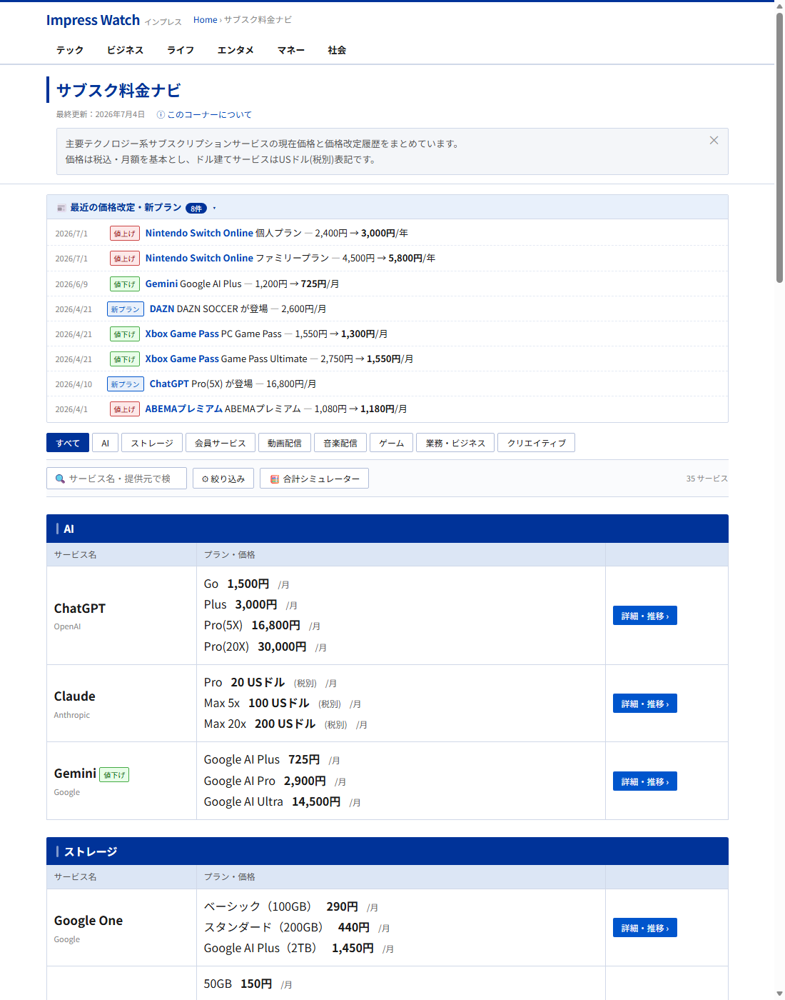
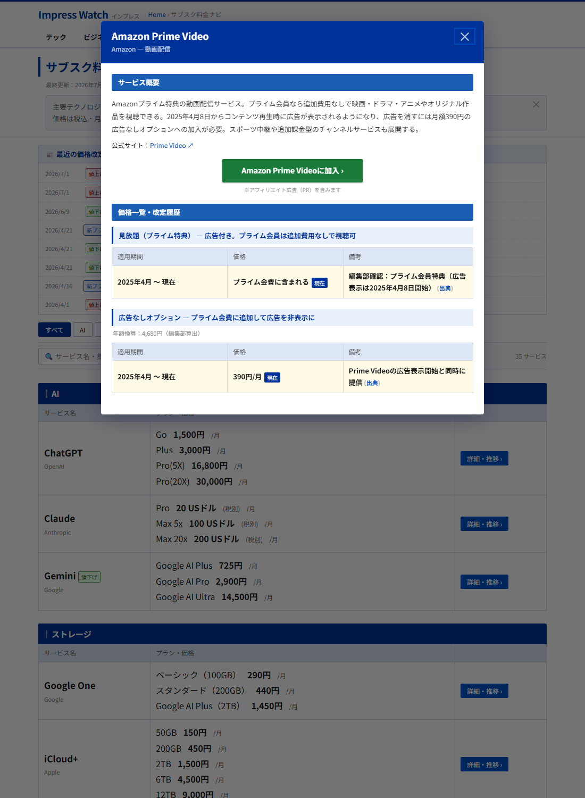
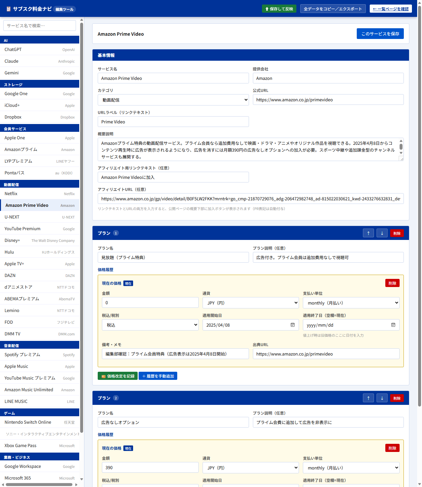

# サブスク料金ナビ 運用マニュアル

主要テック系サブスクリプションの現在価格と改定履歴をまとめるWebサイト「サブスク料金ナビ」の運用手順書です。価格データの更新から公開までを、エンジニアでなくても行えるようにまとめています。

- 公開ページ: https://usudaaa.github.io/subscprice/
- 管理リポジトリ: https://github.com/usudaaa/subscprice

---

## 1. 全体の仕組み

```
編集ツール（edit.html）で入力
   → 保存して反映（data/db.json が更新される）
   → GitHubへpush
   → 1〜2分で公開ページに自動反映
```

データの正本は `data/db.json` の1ファイルです。公開ページ（index.html）も編集ツール（edit.html）も、常にこのファイルを読み書きします。

---

## 2. 公開ページの見方



| 要素 | 説明 |
|---|---|
| 最終更新 | データを保存した日が自動表示されます |
| このコーナーについて | 初回訪問時のみ自動で開き、以降は折りたたみ |
| 最近の価格改定・新プラン | 価格履歴から**自動生成**されるタイムライン（直近6カ月・最大8件）。未読の改定があるときだけ自動で開きます |
| 値上げ/値下げバッジ | 直近12カ月以内に改定があったサービス名の横に自動表示 |
| 絞り込み | 並び順（価格順など）と表示フィルタ |
| 合計シミュレーター | 押すと各プランにチェックボックスが出現し、選んだプランの月額・年額合計を画面下部に表示。サイトにないサブスクの手動追加も可能 |

### 詳細モーダル

サービス名または「詳細・推移」ボタンで開きます。



- **加入ボタン（緑）**: アフィリエイト情報が設定されたサービスにのみ表示。「※アフィリエイト広告（PR）を含みます」の表記が自動で付きます
- **価格推移グラフ**: 改定が2回以上あるプランに階段状グラフを自動表示（値上げ=赤・値下げ=緑のドット）
- **直リンク**: モーダルを開くとURLが `…/#netflix` のようになります。このURLを記事に貼ると、読者は最初からそのサービスの詳細が開いた状態で閲覧できます

---

## 3. 編集ツールの起動

1. プロジェクトフォルダでPowerShellを開き、次を実行:
   ```powershell
   powershell -ExecutionPolicy Bypass -File serve.ps1
   ```
2. ブラウザで `http://localhost:3000/edit.html` を開く

※ index.html / edit.html を**ダブルクリックで直接開くとデータが読み込めません**（必ず上記のサーバー経由で開くこと）。

`http://localhost:3000/edit.html#netflix` のようにサービスIDを付けると、そのサービスの編集画面を直接開けます。

---

## 4. 編集ツールの画面



- **左サイドバー**: カテゴリ別のサービス一覧。上部の検索ボックスで絞り込み
- **基本情報**: サービス名・提供会社・カテゴリ・公式URL・概要説明・アフィリエイト設定
- **プラン**: プランごとの名前・説明と**価格履歴**（黄色い枠が現在の価格）
- **上部ツールバー**: 「⬆ 保存して反映」「全データをコピー／エクスポート」「← 一覧ページを確認」

---

## 5. よくある作業

### 5.1 価格改定を記録する（最重要・推奨フロー）

値上げ・値下げがあったときは、対象プランの **「💴 価格改定を記録」** ボタンを使います。

1. 左サイドバーからサービスを選ぶ
2. 対象プランの「💴 価格改定を記録」を押す
3. ダイアログに **改定日（新価格の適用開始日）・新価格・出典URL・備考** を入力
4. 「旧価格を閉じて新価格を追加」を押す
   - 旧価格の適用終了日が**改定日の前日で自動的に閉じられ**、新しい価格エントリが追加されます
   - 通貨・支払い単位・税込/税別は現在価格から自動で引き継がれます
5. 「⬆ 保存して反映」→ 公開（→5.5）

> 改定を記録すると、公開ページの「最近の価格改定」欄と値上げ/値下げバッジに**自動で反映**されます。手動での告知作業は不要です。

### 5.2 プランの追加・並べ替え・削除

- **追加**: サービス編集画面の下部「＋ プランを追加」
- **並べ替え**: 各プランの「↑」「↓」ボタン（一覧ページの表示順に反映されます）
- **削除**: プラン右上の「削除」
- **履歴を手動追加**: 過去の改定を遡って収録するときは「＋ 履歴を手動追加」。旧エントリの「適用終了日」を必ず入力すること（空欄=現在価格の意味になります）

### 5.3 新サービスの追加

1. サイドバー最下部「＋ 新規サービスを追加」
2. 基本情報とプラン・価格を入力（**出典URLを忘れずに**）
3. 保存して反映

### 5.4 アフィリエイトリンクの設定

基本情報の「概要説明」の下に入力欄があります。

- **アフィリエイト用リンクテキスト**: ボタンに表示される文言（例: `Amazon Prime Videoに加入`）
- **アフィリエイトURL**: ASPから発行されたリンク

**両方**を入力して保存すると、公開ページの詳細モーダル（サービス概要の下）に緑の加入ボタンが表示されます。どちらかが空ならボタンは出ません。ステマ規制対応の「※アフィリエイト広告（PR）を含みます」は自動で付与されます。

### 5.5 保存と公開

1. 「このサービスを保存」（画面内の編集内容を確定）
2. 上部の **「⬆ 保存して反映」**（data/db.json に書き込まれ、最終更新日も自動更新）
3. 公開するには変更をGitHubへpush:
   ```powershell
   git add data/db.json
   git commit -m "価格更新: ○○"
   git push origin main
   ```
   （Claude Codeを使っている場合は「反映して」と頼めばOK）
4. 1〜2分でGitHub Pagesに自動デプロイされます

---

## 6. データ入力のルール

1. **出典の優先度**: ①サービス公式サイト ②Impress Watch ③その他Watchシリーズ（PC Watch・ケータイ Watch・窓の杜・AV Watch等）。他媒体は出典に使わない
2. **出典に明記されていない数字を書かない**: 自分で計算した税込額・換算額などを出典付きデータとして記載しない（例:「消費税10%を徴収開始」はOK、記事にない「税込22ドル」はNG）
3. **改定日**: 出典に明記された日付のみ。不明な場合は備考にその旨を書く
4. **カッコは半角** `()` に統一
5. **ドル建てサービス**は「xx USドル(税別)」表記のまま。円換算は表示しない
6. 概要説明は3〜4文で、プラン間の違い・固有の強み・旧サービス名の文脈を含める（記事調）

---

## 7. トラブルシューティング

| 症状 | 対処 |
|---|---|
| 「データの読み込みに失敗しました」 | ファイルを直接開いています。`http://localhost:3000/…` 経由で開き直す |
| 「⬆ 保存して反映」が失敗する | serve.ps1 が起動しているか確認（→3章） |
| GitHubから「Deploy failed」のメールが届く | GitHub側の一時障害です。空コミットをpushして再実行すれば通ります（`git commit --allow-empty -m "再トリガー" && git push`）。サイトは直前の状態で稼働し続けるので慌てなくてOK |
| 保存したのに公開ページが古い | ブラウザキャッシュの可能性。Ctrl+Shift+R でスーパーリロード |

---

## 8. 付録

- **記事からの誘導リンク**: `https://usudaaa.github.io/subscprice/#サービスID` で特定サービスの詳細を直接開けます（例: `#netflix`、`#chatgpt`、`#prime-video`）。サービスIDは編集ツールのURL末尾でも確認できます
- **データのバックアップ**: 編集ツールの「全データをコピー／エクスポート」からJSON全文を取得できます
- 技術仕様・開発ルールの詳細はリポジトリの `CLAUDE.md` を参照

*最終更新: 2026年7月5日*
